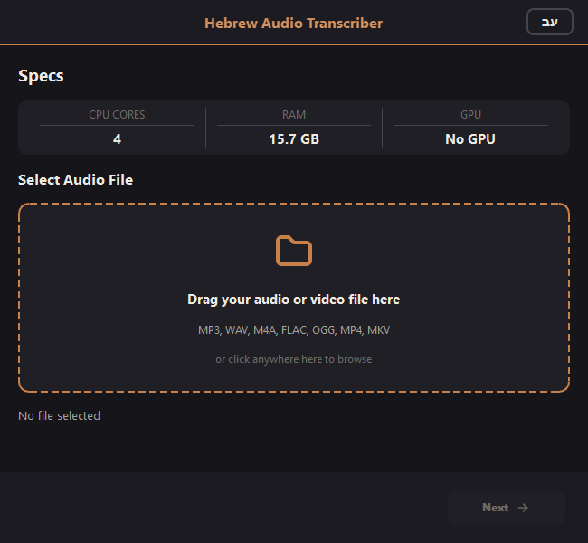
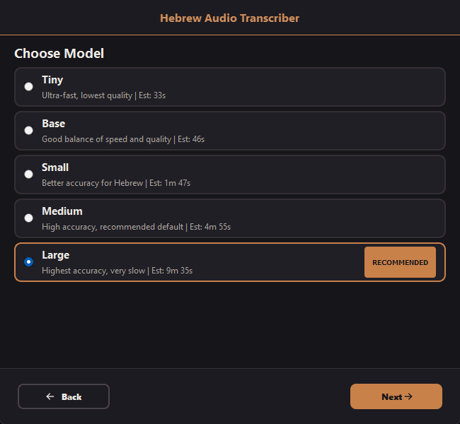
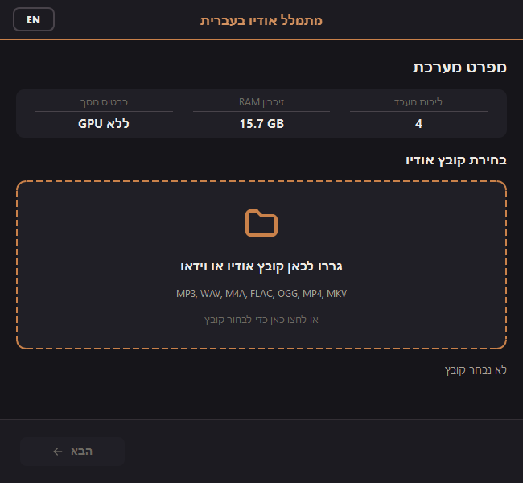
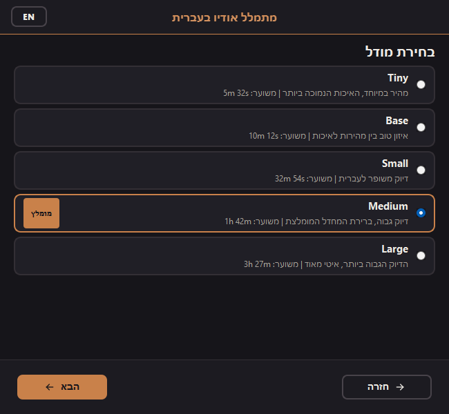
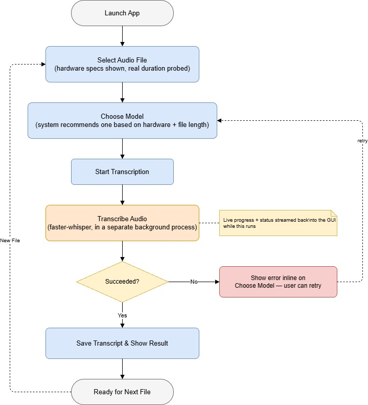

# Hebrew Audio Transcriber


A desktop application that transcribes Hebrew audio and video into text, using [faster-whisper](https://github.com/SYSTRAN/faster-whisper) (a CTranslate2 reimplementation of OpenAI's Whisper) behind a PyQt5 GUI. Everything runs locally: no audio ever leaves your machine.

## Overview

Point it at an audio or video file, and it walks you through a 3-step wizard: pick the file, pick a Whisper model, and transcribe.
- **Bilingual interface (English / עברית)**: starts in English; the עב/EN button in the header switches the whole UI to a fully mirrored right-to-left Hebrew layout, and the choice is remembered between runs.
- **Real hardware-aware recommendations**: the suggested model is computed from your actual CPU/RAM and the file's duration.
- **Text file saving location:** The text file is saved automatically to the same directory from which the audio comes from for easy access.


## Screenshots

|              | File Selection                                            | Model Picking                                           |
| ------------ | --------------------------------------------------------- | ------------------------------------------------------ |
| English      |  |  |
| Hebrew (RTL) |  |  |

## Flow Chart



## Installation

**Requirements:** Python 3.9+, pip, Windows (primary target platform).

```bash
git clone https://github.com/KoganTheDev/hebrew-audio-transcriber.git
cd hebrew-audio-transcriber

python -m venv .venv
.venv\Scripts\activate

pip install -e .
```

For development (tests, linting):

```bash
pip install -r requirements-dev.txt
```

## Usage

```bash
python -m speech_to_text.main
```


**Workflow:**
1. **Select Audio File**: drag a file into the drop zone (or click to browse). Your CPU/RAM/GPU are shown alongside the file's real duration.
2. **Choose Model**: pick from the five Whisper model sizes below; the app pre-selects the highest-accuracy model that will still finish within a reasonable time on your hardware.
3. **Transcribe**: watch live progress, or cancel and return to model selection at any point. Progress and status messages follow the selected UI language, even if you switch mid-run. On completion, the transcript is saved next to the source file.

### Model sizes

| Model | Description | RAM required |
|---|---|---|
| Tiny | Ultra-fast, lowest quality | 1 GB |
| Base | Good balance of speed and quality | 2 GB |
| Small | Better accuracy for Hebrew | 3 GB |
| Medium | High accuracy (default recommendation) | 5 GB |
| Large | Highest accuracy, slowest | 8 GB |

Actual processing time isn't fixed: it's estimated from a one-time benchmark run on your own CPU the first time the app launches, then scaled by model size and the file's real duration.

## Project Structure

```
speech_to_text/
├── main.py                    # Entry point: logging setup, dependency checks, launches the GUI
├── config.py                  # Model definitions and app-wide constants
├── hardware_detection.py      # CPU/RAM/GPU probing, model recommendation, time estimation
├── core/
│   ├── transcriber.py         # Wraps faster_whisper.WhisperModel
│   ├── worker.py              # Runs transcription in a separate OS process
│   ├── calibration.py         # One-time hardware benchmark (also runs out-of-process)
│   └── dependencies.py        # Installs missing runtime dependencies on first launch
└── gui/
    ├── main_window.py         # Main window, wizard navigation, transcription lifecycle
    ├── i18n.py                # English/Hebrew string table, language state, persistence
    ├── widgets.py             # IconTextButton: direction-independent icon+text nav button
    ├── threads.py             # QThread bridge between the GUI and the background process
    ├── steps/                 # One module per wizard step (file select / model select / transcribe)
    ├── theme.py               # Colors, fonts, QSS stylesheet builders
    ├── icons.py               # Tabler icon SVGs, rendered to QPixmap
    └── audio_utils.py         # Real audio/video duration probing (via PyAV)

tests/                          # pytest suite covering config, hardware detection, transcriber, and integration
docs/
├── architecture.drawio         # Editable source for the architecture diagram
└── architecture.jpg            # Rendered diagram (embedded above)
```

## Testing

```bash
pytest                                    # full suite
pytest --cov=speech_to_text --cov-report=html   # with coverage report
pytest tests/test_transcriber.py -v       # a single module
```

## License

MIT. See [LICENSE](LICENSE).
