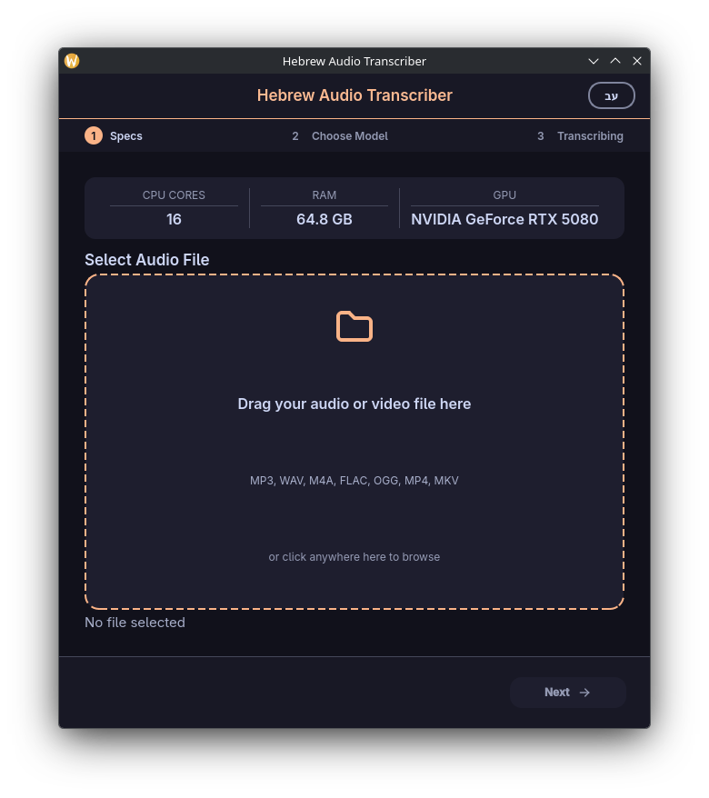
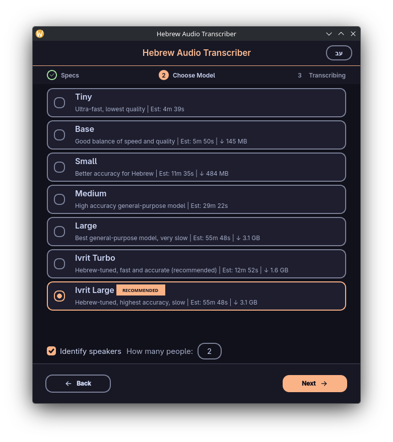
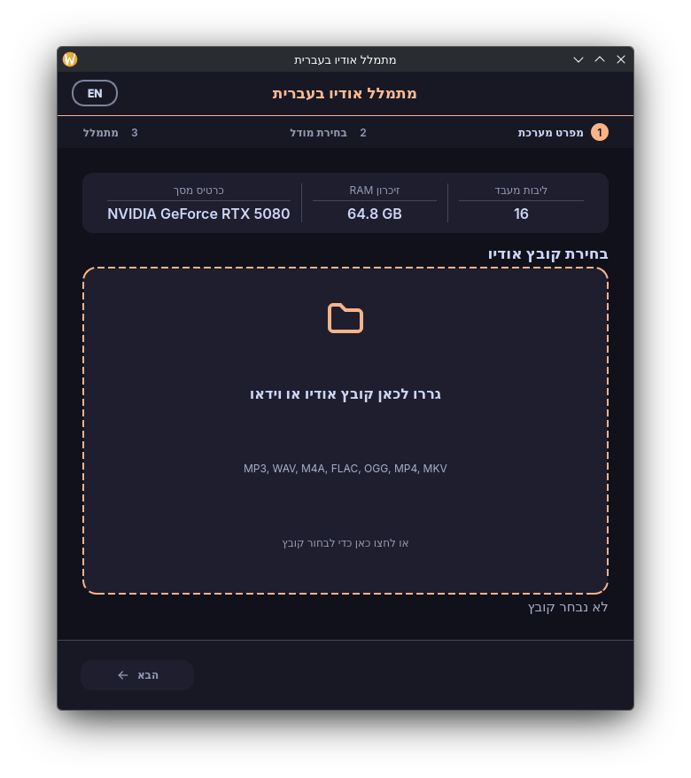
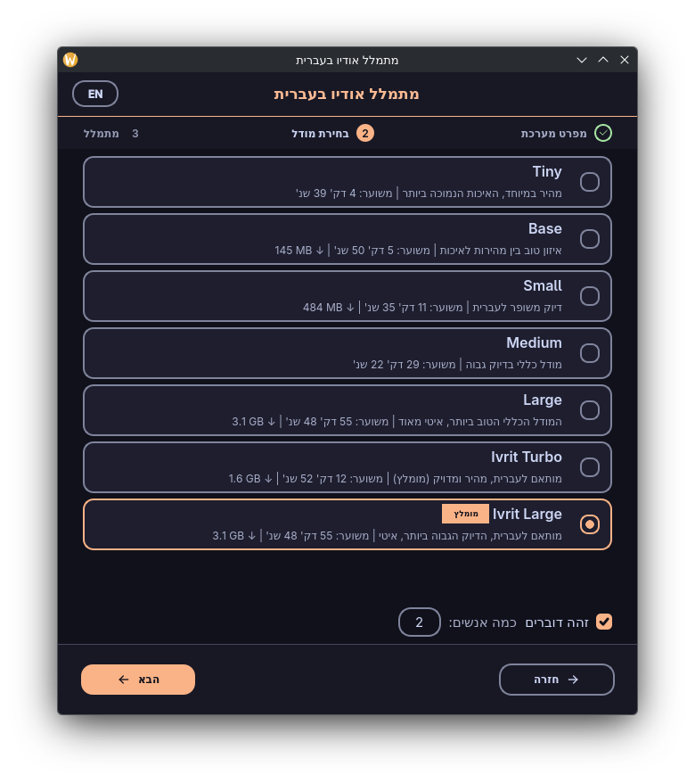
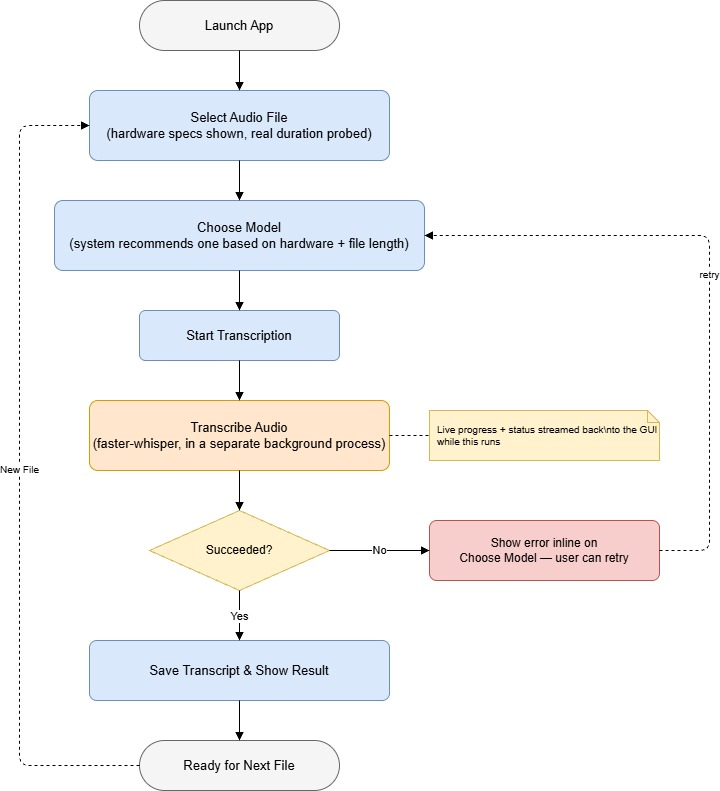

# Hebrew Audio Transcriber


A desktop application that transcribes Hebrew audio and video into timestamped, speaker-labelled text, using [faster-whisper](https://github.com/SYSTRAN/faster-whisper) (a CTranslate2 reimplementation of OpenAI's Whisper) with Hebrew-specialised models, behind a PyQt5 GUI. Everything runs locally: no audio ever leaves your machine, and no account is needed.

## Overview

Point it at an audio or video file, and it walks you through a 3-step wizard: pick the file, pick a model, and transcribe.
- **Hebrew-specialised models**: defaults to [ivrit.ai](https://www.ivrit.ai)'s Hebrew fine-tunes of Whisper rather than stock Whisper, which is trained overwhelmingly on English. The generic Whisper sizes remain available for mixed-language audio.
- **Timestamped speaker turns**: each line of the transcript carries its position in the audio and, where speakers can be identified, who is talking.
- **Bilingual interface (English / עברית)**: starts in English; the עב/EN button in the header switches the whole UI to a fully mirrored right-to-left Hebrew layout, and the choice is remembered between runs.
- **Real hardware-aware recommendations**: the suggested model is computed from your actual CPU/RAM and the file's duration.
- **Text file saving location:** The text file is saved automatically to the same directory from which the audio comes from for easy access.

### Output format

```
‏⁦[0:00:00]⁩ דובר 1: שלום, מה שלומך היום?
‏⁦[0:00:03]⁩ דובר 2: הכול טוב תודה רבה.
```

Consecutive segments from one speaker are merged into a single turn, so the transcript reads as conversation rather than as one line per few seconds of audio.

Timestamps are wrapped in Unicode directional isolates. Square brackets are mirrored characters, so without them a timestamp inside Hebrew text renders backwards as `]0:00:03[`. If you process these files with your own tools, strip `U+2066`, `U+2069` and `U+200F` before parsing.

### Speaker identification

Enabled by default, with a speaker count you can set on the model screen. Telling it exactly how many people are in the recording matters: fixing the count is considerably more reliable than letting the app infer it.

Two paths, chosen automatically:

- **One speaker per channel** (some phone and VoIP call recorders): each channel is transcribed separately, so attribution is exact. Detection is strict, since most stereo audio is really a duplicated mono mix. This roughly doubles transcription time.
- **Single microphone**: neural diarization via [sherpa-onnx](https://github.com/k2-fsa/sherpa-onnx), running offline with no account required. Model weights (~36 MB) download once on first use. Adds roughly a third of the audio's duration to processing time.

If speaker identification fails for any reason, the transcript is still saved — just without labels.

### Correcting names and jargon

Words the model reliably mangles — people, places, organisations, professional vocabulary — can be listed in a `hebrew_terms.txt` file next to where you run the app. Copy [`hebrew_terms.example.txt`](hebrew_terms.example.txt) to get started. Without that file, nothing happens.

Only words the model itself flagged as uncertain are considered, and only your listed terms are candidates. Matching is aware of how Hebrew is actually misheard (א/ע, כ/ק, ט/ת) and of prefixes, so listing `ירושלים` also covers `בירושלים`. Every substitution is written to `speech_to_text.log` so you can check it.

This is not a spell checker, and adding ordinary vocabulary makes it worse rather than better — see the comments in the example file for why.


## Screenshots

|              | File Selection                                            | Model Picking                                           |
| ------------ | --------------------------------------------------------- | ------------------------------------------------------ |
| English      |  |  |
| Hebrew (RTL) |  |  |

## Flow Chart



## Installation

**Requirements:** Python 3.9+, pip, Windows (primary target platform).

```bash
git clone https://github.com/KoganTheDev/hebrew-audio-transcriber.git
cd hebrew-audio-transcriber

python -m venv .venv
.venv\Scripts\activate

pip install -e .
```

For development (tests, linting):

```bash
pip install -r requirements-dev.txt
```

## Usage

```bash
python -m speech_to_text.main
```


**Workflow:**
1. **Select Audio File**: drag a file into the drop zone (or click to browse). Your CPU/RAM/GPU are shown alongside the file's real duration.
2. **Choose Model**: pick from the models below, and set whether to identify speakers. The app pre-selects the highest-accuracy model that will still finish within a reasonable time on your hardware.
3. **Transcribe**: watch live progress, or cancel and return to model selection at any point. Progress and status messages follow the selected UI language, even if you switch mid-run. On completion, the transcript is saved next to the source file.

### Models

| Model | Description | RAM | First-use download |
|---|---|---|---|
| Tiny | Ultra-fast, lowest quality | 1 GB | 76 MB |
| Base | Good balance of speed and quality | 2 GB | 145 MB |
| Small | Better accuracy | 3 GB | 484 MB |
| Medium | High accuracy, general purpose | 5 GB | 1.5 GB |
| Large | Best general-purpose model, very slow | 8 GB | 3.1 GB |
| **Ivrit Turbo** | **Hebrew-tuned, fast and accurate (default)** | **3 GB** | **1.6 GB** |
| Ivrit Large | Hebrew-tuned, highest accuracy, slow | 8 GB | 3.1 GB |

The two Ivrit models are [ivrit.ai](https://www.ivrit.ai/en/2025/02/13/training-whisper/) fine-tunes of Whisper trained on hundreds of hours of transcribed Hebrew. For Hebrew audio they make considerably fewer mistakes than any of the generic sizes above them, and Ivrit Turbo's reduced decoder makes it faster than Medium despite being a larger model. The generic sizes are still the better choice for mixed-language or non-Hebrew recordings.

Actual processing time isn't fixed: it's estimated from a one-time benchmark run on your own CPU the first time the app launches, then scaled by model size, the file's real duration, and whether speaker identification is enabled.

## Project Structure

```
speech_to_text/
├── main.py                    # Entry point: logging setup, dependency checks, launches the GUI
├── config.py                  # Model definitions and app-wide constants
├── hardware_detection.py      # CPU/RAM/GPU probing, model recommendation, time estimation
├── core/
│   ├── transcriber.py         # Wraps faster_whisper.WhisperModel
│   ├── segments.py            # Structured transcript: timings, per-word confidence, speaker
│   ├── formatting.py          # Turn merging and RTL-safe transcript rendering
│   ├── options.py             # Settings for one run, passed to the worker process
│   ├── audio_source.py        # PyAV decoding and one-speaker-per-channel detection
│   ├── diarization.py         # sherpa-onnx speaker identification and span assignment
│   ├── hebrew_correct.py      # Confidence-gated correction against a user term list
│   ├── hebrew_text.py         # Shared Hebrew normalization (nikud, final forms, clitics)
│   ├── worker.py              # Runs transcription in a separate OS process
│   ├── calibration.py         # One-time hardware benchmark (also runs out-of-process)
│   └── dependencies.py        # Installs missing runtime dependencies on first launch
└── gui/
    ├── main_window.py         # Main window, wizard navigation, transcription lifecycle
    ├── i18n.py                # English/Hebrew string table, language state, persistence
    ├── widgets.py             # IconTextButton: direction-independent icon+text nav button
    ├── threads.py             # QThread bridge between the GUI and the background process
    ├── steps/                 # One module per wizard step (file select / model select / transcribe)
    ├── theme.py               # Colors, fonts, QSS stylesheet builders
    ├── icons.py               # Tabler icon SVGs, rendered to QPixmap
    └── audio_utils.py         # Real audio/video duration probing (via PyAV)

tests/                          # pytest suite covering config, hardware detection, transcriber, and integration
docs/
├── architecture.drawio         # Editable source for the architecture diagram
└── architecture.jpg            # Rendered diagram (embedded above)
```

## Testing

```bash
pytest                                    # full suite
pytest --cov=speech_to_text --cov-report=html   # with coverage report
pytest tests/test_transcriber.py -v       # a single module
```

### Comparing models on your own audio

`tests/eval/` holds a dev-only harness, kept out of the pytest suite because it needs real recordings and takes minutes:

```bash
python -m tests.eval.compare_models path/to/audio.m4a --models medium ivrit-turbo
```

It writes both transcripts side by side for reading, plus speed and confidence metrics.

Note what those metrics are and are not. Without a reference transcript there is no accuracy percentage to report: confidence figures correlate with quality but do not measure it, and a confidently wrong model scores well. Hand-correct a few minutes of transcript and pass it with `--reference` to get a real word error rate, computed with Hebrew-appropriate normalization (nikud, final letters, and the app's own timestamps and speaker labels are all discounted).

## License

MIT. See [LICENSE](LICENSE).
