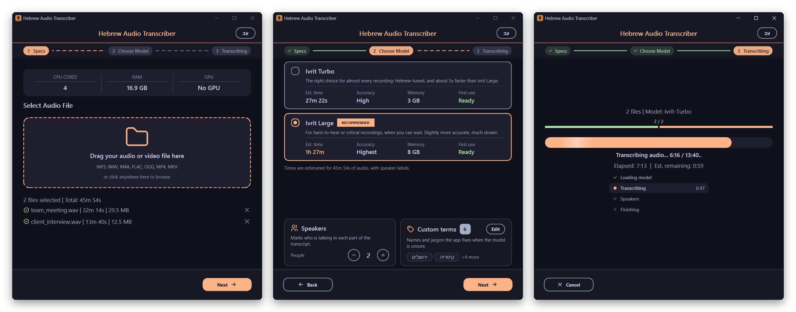
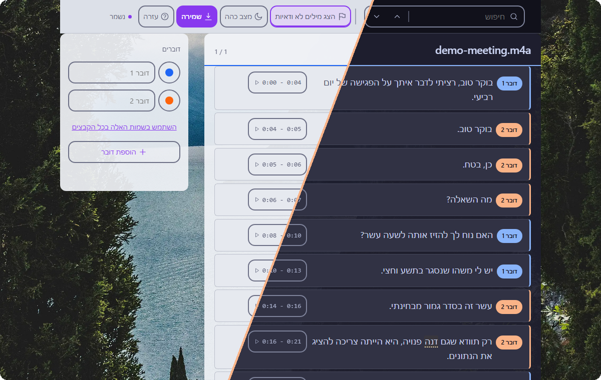

<div align="center">


# Hebrew Audio Transcriber

**Hebrew audio and video in, a speaker-labelled, timestamped, editable transcript out. Fully offline.**


[Features](#features) · [Getting started](#getting-started) · [Models](#models) · [The transcript](#the-transcript) · [Development](#development)



</div>

A desktop app built on [faster-whisper](https://github.com/SYSTRAN/faster-whisper) with [ivrit.ai](https://www.ivrit.ai)'s Hebrew fine-tunes of Whisper. No audio leaves your machine and no account is needed.

## Features

- **Hebrew-tuned models** - far fewer mistakes on Hebrew than stock Whisper, which is trained mostly on English.
- **Who said what, and when** - speaker identification and a timestamp on every turn.
- **Batch runs** - pick several files or drop a folder; one model load, one combined document.
- **Fits your hardware** - estimates each model's time on your CPU/GPU and pre-selects the best one that will finish in reasonable time.
- **Custom terms** - names and jargon the model gets wrong are corrected where it was unsure.
- **Bilingual UI** - English or a fully mirrored Hebrew layout, one click or `Ctrl+Shift+L` away.

## Getting started

Requires Windows and Python 3.10+.

```bash
git clone https://github.com/KoganTheDev/hebrew-audio-transcriber.git
cd hebrew-audio-transcriber
```

Then double-click **`run.bat`**. On first launch it offers to create `.venv` and install everything, then starts the app.

<details>
<summary>Manual setup</summary>

```bash
python -m venv .venv
.venv\Scripts\activate
python -m pip install --upgrade pip
pip install -e .
python src\app.py
```

- Upgrade pip first: the pip bundled with older interpreters (22.3 on Python 3.11.0) aborts long installs with `OSError: [Errno 2] ... pip-build-tracker`.
- `pip install -e .` installs the dependencies only. The app runs from `src/`, and `app.py` restarts itself on `.venv` when launched from another interpreter.
- `run.bat setup` (or `run.ps1 -Setup`) runs the setup without the prompt.

</details>

> [!TIP]
> **NVIDIA GPU:** the app detects and uses it automatically, but needs the cuBLAS/cuDNN runtime. Install it with `pip install -e ".[gpu]"`; without it, transcription falls back to CPU. No CUDA toolkit required.

## Models

| Model | Best for | RAM | First download |
|---|---|---|---|
| **Ivrit Turbo** | Almost every recording. Hebrew-tuned and about 5x faster than Large | 3 GB | 1.6 GB |
| Ivrit Large | Hard-to-hear or critical recordings, when you can wait | 8 GB | 3.1 GB |

Time estimates come from a one-time benchmark on your hardware at first launch, scaled by model, audio length and whether speakers are identified.

> [!NOTE]
> Stock Whisper sizes are no longer offered: on Hebrew each was less accurate than Ivrit Turbo. Old downloads in `whisper_models/` can be deleted, except `models--Systran--faster-whisper-tiny`, which the benchmark uses.

## The transcript



Each run writes one self-contained HTML file next to the audio. Open it in any browser to:

- edit any turn in place, and rename or recolour speakers
- search across every file (`/`), or switch to a plain-text view
- play the audio from any timestamp
- review highlighted uncertain words: pick a term, type a fix, or keep it

> [!IMPORTANT]
> Edits save to your browser's local storage, not to the file. Press **Save a copy** (`Ctrl+S`) to download an HTML file with your edits in it; that is the one to keep or send.

Full guide: [docs/USING_THE_TRANSCRIPT.md](docs/USING_THE_TRANSCRIPT.md). The screenshot uses invented dialogue rendered by `tools/render_demo_transcript.py`, not a real recording.

## Development

```bash
pip install -e ".[dev]"
pytest
```

[docs/ARCHITECTURE.md](docs/ARCHITECTURE.md) covers the module layout and the two import rules CI enforces; [docs/TESTING.md](docs/TESTING.md) covers test levels, coverage and the CI checks.
